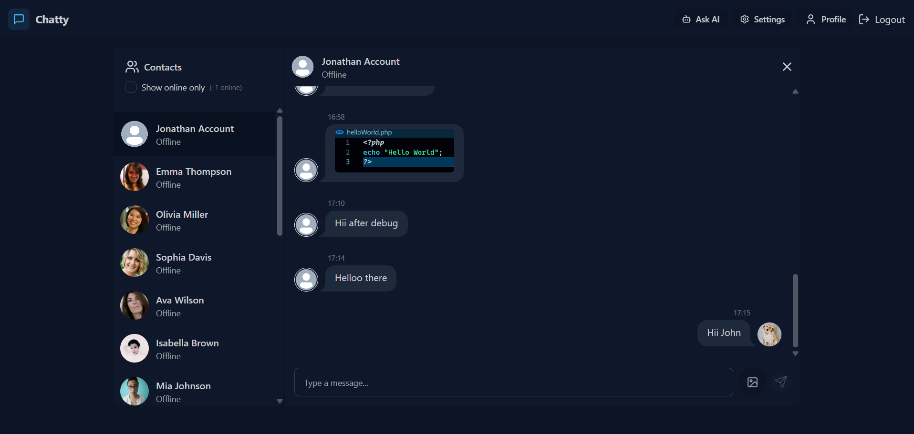

# <h1 align="center">Chatty🗯️</h1>



Chatty is a full-stack real-time chat application featuring user authentication, profile management, image sharing, and an integrated AI assistant powered by Google Gemini. Built with a React frontend and Node.js/Express backend, it uses MongoDB for data storage and supports real-time messaging via Socket.IO.

## Features🔥

- User authentication (signup, login, logout)
- Real-time messaging with Socket.IO
- Profile picture upload (Cloudinary integration)
- Online user status
- Responsive UI with theme switching (DaisyUI/TailwindCSS)
- 32 Different themes
- AI Assistant (Google Gemini API)
- Image sharing in chat

## Tech Stack

- **Frontend:** React, Zustand, React Router, DaisyUI, TailwindCSS, Axios, Socket.IO Client
- **Backend:** Node.js, Express, MongoDB, Mongoose, Socket.IO, Cloudinary, JWT, Multer
- **AI:** Google Gemini API

## Project Structure

```
chatty/
  backend/
    src/
      config/
      controllers/
      middleware/
      models/
      routes/
      seeds/
      utils/
    package.json
    .env
  frontend/
    src/
      components/
      config/
      constants/
      pages/
      store/
      utils/
    public/
    package.json
    tailwind.config.js
    vite.config.js
  package.json
```

## Getting Started

### Prerequisites

- Node.js (v18+ recommended)
- MongoDB instance (local or cloud)
- Cloudinary account (for image uploads)
- Google Gemini API key

### Environment Variables

Create a `.env` file in `backend/` with the following:

```
PORT=5001
MONGODB_URI=your_mongodb_connection_string
JWT_SECRET=your_jwt_secret
NODE_ENV=development
CLOUDINARY_CLOUD_NAME=your_cloudinary_cloud_name
CLOUDINARY_API_KEY=your_cloudinary_api_key
CLOUDINARY_API_SECRET=your_cloudinary_api_secret
GEMINI_API_KEY=your_gemini_api_key
```

### Installation

1. **Clone the repository:**

   ```sh
   git clone https://github.com/yourusername/chatty.git
   cd chatty
   ```

2. **Install dependencies:**

   ```sh
   npm install
   ```

   This will install dependencies for both `backend` and `frontend`.

3. **Seed the database (optional):**
   ```sh
   cd backend
   node src/seeds/user.seed.js
   cd ..
   ```

### Running the App

#### Development

- **Backend:**

  ```sh
  cd backend
  npm run dev
  ```

- **Frontend:**
  ```sh
  cd frontend
  npm run dev
  ```

#### Production

- Build frontend:
  ```sh
  cd frontend
  npm run build
  ```
- Start backend (serves frontend build):
  ```sh
  cd ../backend
  npm start
  ```

## Usage

- Visit [http://localhost:5173](http://localhost:5173) in your browser.
- Sign up, log in, and start chatting!

---
